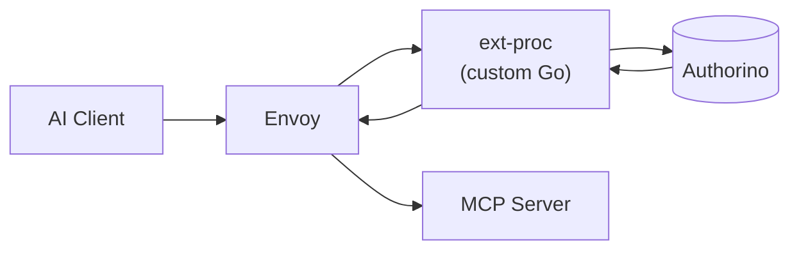
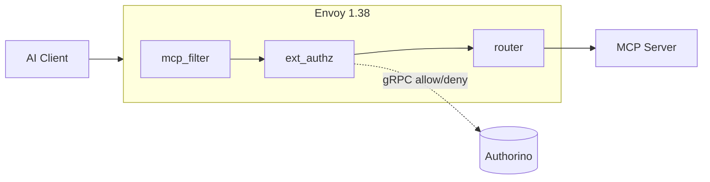
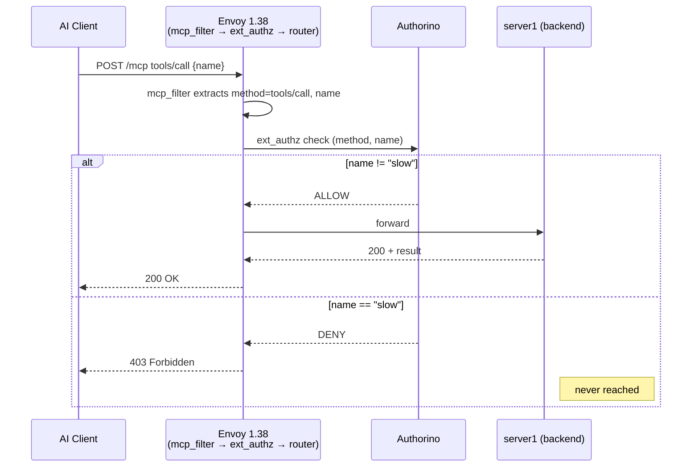

# Native MCP Filter (Envoy) as mcp-gateway Replacement (Single MCP Server)

## Context

Single-server deployment (e.g. a service that exposes tools like search, summarize, query-db) sits behind Envoy, and all AI client (ex: claude code or codex) traffic goes through Envoy first.

Today, Kuadrant's mcp-gateway uses a custom Go component called ext-proc to handle access control. It is an external process that Envoy calls for every incoming request. ext-proc reads the request, pulls out the tool name, and hands it to Authorino (Kuadrant's policy engine, which says allow or deny).

Envoy 1.38 added a native MCP filter (`mcp_filter`) that does what ext-proc does — parse AI tool requests and extract the tool name — without any custom code. The question is whether we can wire that directly to Authorino and skip mcp-gateway entirely.

**Before (mcp-gateway):**
```
AI Client → Envoy → ext-proc (custom Go) → Authorino → MCP Server
```


**After (native filter chain):**
```
AI Client → Envoy [mcp_filter → ext_authz → router] → MCP Server
                                    ↓
                                Authorino
```


## Answer

Yes: Envoy's native filter reads the tool name from each request and passes it to Authorino. Authorino enforces the policy correctly. No custom code or mcp-gateway is needed.

There is one version-gap to be aware of before putting this in production (covered in the [Deployment Notes](#deployment-notes) section at the end).

## What We Tested

We used [`server1`](https://github.com/Kuadrant/mcp-gateway/tree/main/tests/servers/server1), a real test MCP server from `Kuadrant/mcp-gateway`'s own test suite — not a hand-rolled mock. It exposes `time`, `slow`, `greet`, `headers`, and `add_tool`. The policy was simple: allow everything except `slow`.

We wanted to confirm two things:

1. Does Envoy's native filter correctly read the tool name out of real MCP requests?
2. Does Authorino receive that name and make the right allow/deny call?

We also ran a set of edge cases — malformed requests, missing fields, wrong HTTP verbs — to make sure the system fails safely when it gets unexpected input.

**Setup:**

- Local Kubernetes cluster (kind)
- Kuadrant installed via Helm
- Istio 1.27
- Envoy v1.38.0 (standalone deployment, not bundled with Istio)
- Authorino (Kuadrant's policy engine)
- Test MCP server — `Kuadrant/mcp-gateway`'s own [`tests/servers/server1`](https://github.com/Kuadrant/mcp-gateway/tree/main/tests/servers/server1)

Inside the kind cluster: `Envoy v1.38.0 → Authorino → server1 (time, slow, greet, headers, add_tool)`

**Filter chain**, confirmed via live config dump at runtime:

```
mcp_filter (reads tool name) → ext_authz (calls Authorino) → router
```

**Request flow**, allow vs. deny:



## Test Results

Policy: allow all tools except `slow`. 13 tests run via [`kuadrant/smoke.sh`](https://github.com/k1chik/mcp-native-investigation/blob/master/tests/capability/c5/kuadrant/smoke.sh) — full output in [`results/c5-kuadrant.txt`](../../results/c5-kuadrant.txt).

| # | What we sent | What Envoy extracted | Decision | Result (status code) |
|---|---|---|---|---|
| 1 | `initialize` | `method=initialize` | Allow | 200 |
| 2 | `tools/list` | `method=tools/list` | Allow | 200 |
| 3 | `tools/call time` | `method=tools/call, name=time` | Allow | 200 |
| 4 | `tools/call slow` | `method=tools/call, name=slow` | Deny | 403 |
| 5 | `tools/call greet` | `method=tools/call, name=greet` | Allow | 200 |
| 6 | `tools/call` unknown tool | `method=tools/call, name=does_not_exist` | Allow | 200 |
| 7 | `tools/call` with no tool name | `method=tools/call` (no name field) | Deny | 403 |
| 8 | `tools/call` with empty name `""` | `method=tools/call, name=` | Allow | 200 |
| 9 | `tools/call slow` + extra fields | `method=tools/call, name=slow` | Deny | 403 |
| 10 | Request with no method field | nothing extracted | Deny | 403 |
| 11 | Empty request body | nothing extracted | Deny | 403 |
| 12 | Non-JSON body | could not parse | - | 400 |
| 13 | GET request (wrong verb) | nothing extracted | Deny | 403 |

## Evidence

Envoy's access log was configured to print exactly what the native filter extracted from each request. This makes the evidence direct — you can see what Authorino actually received, not just what status code the client got back. (From [`results/c5-kuadrant.txt`](../../results/c5-kuadrant.txt).)

| Request | What the filter extracted | Status |
|---|---|---|
| `tools/call time` | `{"method":"tools/call","params":{"name":"time"}}` | 200 |
| `tools/call slow` | `{"method":"tools/call","params":{"name":"slow"}}` | 403 |
| `tools/call` (no name) | `{"method":"tools/call"}` | 403 |
| empty body | `null` | 403 |
| GET request | `null` | 403 |

**Fail-closed:** if Authorino is unreachable, requests are denied — nothing slips through. Every `smoke.sh` run, including the latest, confirms Envoy's `failure_mode_allowed` stat stays at `0` across the full test run: no request was ever waved through because Authorino couldn't be reached. Forcing a clean, sustained Authorino outage on this cluster is harder than it sounds — the Kuadrant operator reconciles Authorino's replica count back to 1 within seconds of a manual scale-down, so a simple `kubectl scale --replicas=0` doesn't produce a reliably observable gap. Simulating a real outage would need something like a `NetworkPolicy` blocking Envoy's egress to Authorino.

## Two Things to Know Before Deploying

1. **Metadata forwarding must be turned on explicitly.** Envoy does not forward what the filter extracts to Authorino by default. `metadata_context_namespaces` must be set in the `ext_authz` filter config. Without it, Authorino receives nothing and cannot make a decision.

2. **OPA policy syntax must be kept simple.** The version of OPA bundled with Kuadrant does not support newer Rego syntax (`if` keyword, `default allow`, named helper rules). Policies must use flat `allow { }` rules.

Both are documented with working examples in [`authconfig.yaml`](https://github.com/k1chik/mcp-native-investigation/blob/master/tests/capability/c5/kuadrant/manifests/authconfig.yaml).

## Deployment Notes

This POC ran Envoy 1.38 as a standalone deployment, not through Istio. This is because the current Istio release (1.27) bundles Envoy 1.34: the native MCP filter only exists in 1.38+. As a result, we also had to use AuthConfig (Authorino's lower-level API) directly instead of Kuadrant's AuthPolicy, which requires Istio in the request path.

These are both version-gap issues, not actual design problems. Once Istio ships with Envoy 1.38+ (estimated Istio 1.29–1.30), the steps to move to the full integrated setup are:

1. Replace the standalone Envoy deployment with an `EnvoyFilter` on the Istio Gateway
2. Replace AuthConfig with a Kuadrant AuthPolicy on the HTTPRoute
3. Remove mcp-gateway from the single-server path

Until then, the standalone Envoy 1.38 approach used in this POC is a working interim — it connects directly to Authorino and requires no changes to the Kuadrant operator or Istio installation.

**Reproducible setup:**

- `kuadrant/create-env.sh`
- `kuadrant/smoke.sh`
- `kuadrant/manifests/`