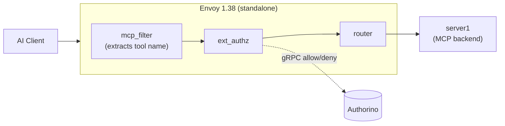
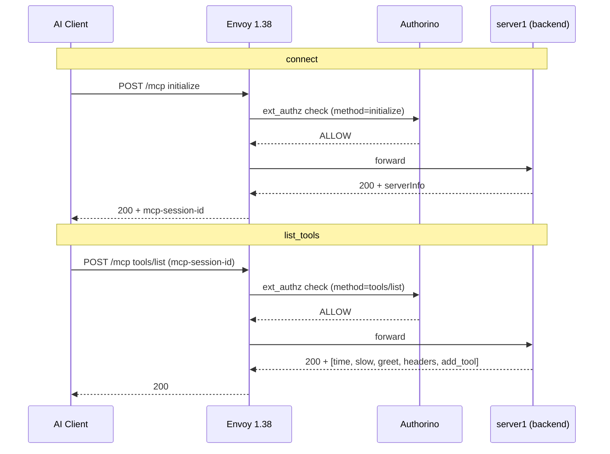
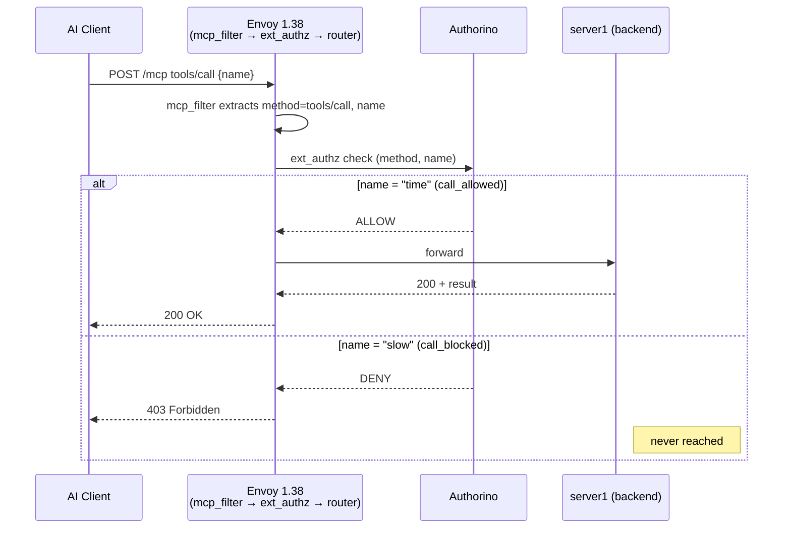

# Native MCP Filter Demo

Live demo: Envoy 1.38's native MCP filter (`envoy.filters.http.mcp`) replacing `mcp-gateway`'s
custom ext-proc for a single MCP server, wired directly to Authorino for tool-level policy
enforcement.

Read [`Native MCP Filter as mcp-gateway Replacement.md`](./Native%20MCP%20Filter%20as%20mcp-gateway%20Replacement.md)
first for the full write-up — context, architecture, the 13-test result table, and the
version-gap notes. This README only covers how to stand the environment up and run the demo.

Giving the live demo? Run [`start-env.sh`](start-env.sh) first — it checks the cluster and
required pods are healthy and starts (or reuses) the port-forward `demo.sh` needs.

```
AI Client → Envoy [mcp_filter → ext_authz → router] → MCP Server
                            ↓
                        Authorino
```


---

## Prerequisites

- [`kind`](https://kind.sigs.k8s.io/)
- [`helm`](https://helm.sh/)
- [`kubectl`](https://kubernetes.io/docs/tasks/tools/#kubectl)
- [`istioctl`](https://istio.io/downloadIstio) 1.27+
- `docker` (daemon running — kind runs cluster nodes as containers, and it's used to build the test server image)
- `git` (used to clone `Kuadrant/mcp-gateway` to build the test MCP server)
- `python3` (used to format demo output; no extra packages needed)

macOS: all of the above except `istioctl` are installable via Homebrew
(`brew install kind helm kubectl git`). `istioctl` must be downloaded manually.

---

## 1. Stand up the cluster

From the repo root:

```bash
cd tests/capability/c5/kuadrant
./create-env.sh
```

This is a one-shot, idempotent script. It will:

1. Delete any existing `kuadrant-poc` kind cluster and create a fresh one
2. Install Gateway API CRDs
3. Install Istio 1.27 (mesh only — its bundled Envoy is 1.34/1.35 and doesn't have `mcp_filter`)
4. Install the Kuadrant operator (provisions Authorino)
5. Clone [`Kuadrant/mcp-gateway`](https://github.com/Kuadrant/mcp-gateway), build its
   [`tests/servers/server1`](https://github.com/Kuadrant/mcp-gateway/tree/main/tests/servers/server1)
   test MCP server, and load it into the kind cluster — this is a real backend from
   `mcp-gateway`'s own test suite, not a hand-rolled mock. It exposes `time` (allowed by
   the demo's policy) and `slow` (blocked), plus `greet`, `headers`, `add_tool`.
6. Deploy that server, then a **standalone** Envoy 1.38 in front of it, with the filter chain
   `mcp_filter → ext_authz → router`, plus the `AuthConfig` policy (deny `slow`, allow everything else)

Takes a few minutes, mostly waiting on Istio + Authorino to come up. If you want to confirm the
whole matrix (13 cases: allow/deny, malformed requests, missing fields, wrong verbs, fail-closed
under an Authorino outage) before doing the live demo:

```bash
./smoke.sh
```

To tear it all down: `kind delete cluster --name kuadrant-poc`. Re-running `./create-env.sh` also
does this for you automatically before rebuilding.

---

## 2. Run the demo

Two terminals.

**Terminal 1** — keep this running in the background the whole time:

```bash
kubectl --context kind-kuadrant-poc -n mcp-demo port-forward svc/envoy138 10000:10000 9901:9901
```

This just tunnels your laptop's `localhost:10000` (Envoy's proxy port) and `localhost:9901`
(Envoy's admin/stats port) into the pod — it doesn't create or change anything in the cluster.
If you get `address already in use`, something is already bound to those ports; find it with
`lsof -nP -iTCP:10000 -sTCP:LISTEN` and either reuse it or kill it.

**Terminal 2** — the demo/recording terminal:

```bash
cd native-mcp-filter-demo
source demo.sh
```

Then run these one at a time, narrating as you go:

| Command | What it shows |
|---|---|
| `connect` | Opens an MCP session with the server, through Envoy |
| `list_tools` | Lists available tools — flags `slow` as blocked by policy |
| `call_allowed` | Calls `time` → `200`, request reaches the backend |
| `call_blocked` | Calls `slow` → `403`, stopped before reaching the backend |
| `show_proof` | Envoy's own access log (what `mcp_filter` extracted per request) + `ext_authz` stats, including `failure_mode_allowed: 0` — the fail-closed proof |
| `tail_authorino` | *(if asked)* Live tail of Authorino's raw allow/deny decisions. Caveat: this log shows `authorized: true/false` per request but not the tool name — that only lives in Envoy's `ext_authz` metadata, shown in `show_proof`. `Ctrl+C` to stop. |

### Request flow

`connect` + `list_tools` — establishing a session:



`call_allowed` vs. `call_blocked` — the actual policy decision:



---

## Troubleshooting

- **`create-env.sh` fails on a missing tool** — install it and re-run; the script is idempotent.
- **`istioctl install` hangs or fails** — confirm `istioctl version` reports 1.27+ and that Docker
  has enough resources allocated (Istio + Authorino + Envoy need a few GB of RAM).
- **mock-mcp-server pod stuck in `ImagePullBackOff` / `ErrImageNeverPull`** — the `mcp-server1:demo`
  image didn't make it into kind. Re-run `./create-env.sh`; if the `docker build` step failed,
  check that Docker has network access to clone `github.com/Kuadrant/mcp-gateway`.
- **`port-forward` says a port is already in use** — a previous `port-forward` from an earlier
  session is likely still running. `lsof -nP -iTCP:10000 -sTCP:LISTEN` to find the PID, `kill` it,
  then retry.
- **`show_proof` prints nothing** — the Envoy access log only has entries from the last `--since=10m`
  of traffic; run `connect` / `call_allowed` / `call_blocked` again first.
