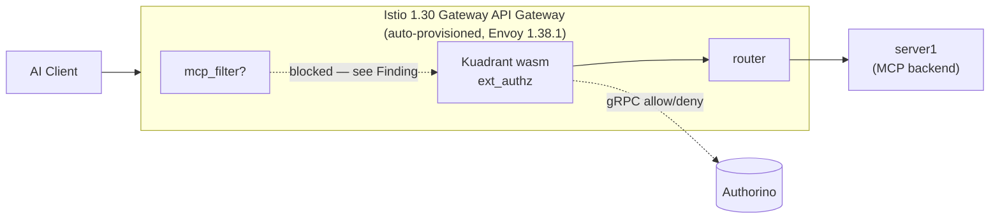

# C6 — Istio 1.30 (Envoy 1.38) + Kuadrant AuthPolicy

**Status: BLOCKED** (not a design problem — see Finding)

## What it tests

C5/kuadrant proved the native filter chain works, but needed two workarounds because
production Istio (1.27) bundles Envoy 1.34/1.35, which lacks `mcp_filter`:

1. A **standalone Envoy 1.38** deployment, bypassing Istio's own proxy entirely
2. A hand-written **AuthConfig** (Authorino's low-level API) instead of Kuadrant's
   higher-level **AuthPolicy**, because AuthPolicy only targets Gateway API resources
   on a real mesh/gateway controller

Istio 1.30 (released May 2026) bundles Envoy 1.38. This lane asks: does that close the
gap? Can a plain Istio 1.30 Gateway API `Gateway` + Kuadrant `AuthPolicy` now do
everything C5/kuadrant did by hand?



## What we found

**Envoy version is not the whole story.** Istio ships its own curated build of Envoy
(`registry.istio.io/release/proxyv2`) with only a subset of upstream extensions compiled
in. Istio 1.30's Gateway workload confirms `1.38.1-dev` via `/server_info` — but asking
it to load `envoy.filters.http.mcp` via `EnvoyFilter` gets rejected outright:

```
Error adding/updating listener(s) 0.0.0.0_80: Didn't find a registered implementation
for 'envoy.filters.http.mcp' with type URL: 'envoy.extensions.filters.http.mcp.v3.Mcp'
```

So the native filter still cannot run inside Istio's own Gateway, even on 1.30. The
standalone-Envoy workaround from C5/kuadrant is still required for that part.

This is confirmed at the source level too, not just at runtime: Istio compiles a curated
subset of upstream Envoy HTTP filters into its proxy image, listed by name in
[`extensions_build_config.bzl`](https://github.com/istio/proxy/blob/d0839b6065c3b0ff6bdefb1bfaa97c98fc8cb61b/bazel/extension_config/extensions_build_config.bzl)
(the exact commit backing our Istio 1.30 install). It lists ~50 HTTP filters —
`ext_authz`, `ext_proc`, `oauth2`, `jwt_authn`, etc. — and `envoy.filters.http.mcp` is not
among them.

**AuthPolicy itself, independent of the filter, works cleanly.** With the broken
`EnvoyFilter` removed, a sanity `AuthPolicy` (deny-all) applied to the same Istio 1.30
Gateway API `Gateway`/`HTTPRoute` was enforced correctly — a plain `403`, with **zero**
hand-written Envoy config. Kuadrant auto-injects its own `EnvoyFilter` (a wasm plugin)
to wire the gateway to Authorino; nothing like `envoy138.yaml` or `authconfig.yaml`'s
manual `ext_authz` block was needed.

**Conclusion:** the blocker is narrower than "wait for Istio to bundle Envoy 1.38+" —
Istio 1.30 already does that. The actual blocker is that Istio's own proxy build
doesn't yet compile in `envoy.filters.http.mcp`. Once it does, swapping AuthPolicy in
for AuthConfig should be a small follow-on, not a new investigation — this lane already
proves the AuthPolicy plumbing works.

Full run: [`results/c6.txt`](../../../results/c6.txt).

## Reproduce

```bash
cd tests/capability/c6
./create-env.sh
./smoke.sh
```

`create-env.sh` creates a separate kind cluster (`kuadrant-native-poc`) so it doesn't
disturb the `kuadrant-poc` cluster used by [`c5/kuadrant`](../c5/kuadrant/) or the
[community demo](../../../native-mcp-filter-demo/). Requires the same tools as
`c5/kuadrant` plus **istioctl 1.30+** — download from
[istio.io/downloadIstio](https://istio.io/downloadIstio); a Homebrew-installed
`istioctl` may lag behind, so check `istioctl version --remote=false` first.

`smoke.sh` runs three checks in order (see [`results/c6.txt`](../../../results/c6.txt)
for full output):

1. Confirms the Gateway workload's Envoy version via `/server_info`
2. Attempts to load `envoy.filters.http.mcp` via `manifests/mcp-filter-envoyfilter.yaml`
   — expected to be rejected (removes it afterward so later config pushes aren't blocked)
3. Applies `manifests/authpolicy-sanity.yaml` (deny-all) and confirms it's enforced,
   proving AuthPolicy mechanics work on Istio 1.30 independent of the filter question

## If this changes

If a future Istio release does compile in `envoy.filters.http.mcp`, re-run `smoke.sh`
step 2 first — if it stops being rejected, this lane should be rewritten from a
"BLOCKED" probe into a full test matrix (mirroring
[`c5/kuadrant/smoke.sh`](../c5/kuadrant/smoke.sh)'s 13 cases), with the `AuthConfig`
replaced by an `AuthPolicy` that reads `envoy.filters.http.mcp` metadata — the open
question at that point would be whether Kuadrant's wasm shim forwards that metadata
namespace to Authorino by default, or whether that needs its own config knob.
